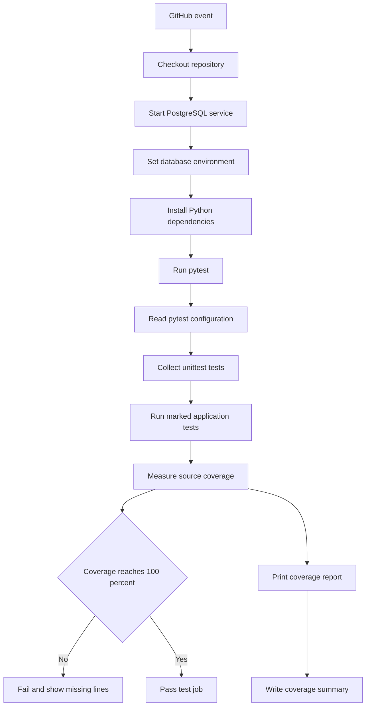

# Module 4 Test Workflow

## At a glance



## Step-to-code map

| Workflow stage | File or function used |
| --- | --- |
| Trigger, Python setup, PostgreSQL service, environment, install, and report piping | `.github/workflows/tests.yml` at repository root |
| Test paths, import paths, markers, coverage target, report format, and 100% threshold | `module_4/pytest.ini` |
| Web route and page checks | `tests/test_flask_page.py`: `TestAnalysisPage`; exercises `app.app.index()` |
| Button state checks | `tests/test_buttons.py`: `TestAnalysisButtons`; exercises `app.app.pull_data()` and `app.app.update_analysis()` |
| Rendered analysis labels and ORM/raw SQL questions | `tests/test_analysis_format.py`: `TestAnalysisFormat`, `TestOrmQueries`, `TestRawQueries`; exercises `orm_queries.question_*()`, `orm_queries.main()`, and `query_data.py` |
| Schema, loader, cleaner, database creator, and pull helpers | `tests/test_db_insert.py`: `TestDatabaseInsert`, `TestCleanData`, `TestCreateDatabase`, `TestLoadData`, `TestPullData`, `TestPullRecordDeduplication` |
| Pull/update/render and scraper behavior | `tests/test_integration_end_to_end.py`: `TestPullUpdateRender`, `TestScraper`; exercises `pull_data.main()`, `scrape.GradCafeScraper`, `scrape.scrape_data()`, and `scrape.save_data()` |
| Coverage calculation and gate | pytest-cov options in `module_4/pytest.ini`, applied to all Python files under `module_4/src` |
| Saved terminal output | `module_4/coverage_summary.txt`, written by `tee` in CI or `Tee-Object` locally |

## What pytest does

`module_4/pytest.ini` sets the test directory and import paths, registers the five markers, and adds the coverage options:

- `--cov=module_4/src` measures Python code under `module_4/src`.
- `--cov-report=term-missing` prints statement counts, coverage, and any missed lines.
- `--cov-fail-under=100` makes pytest return a failing status below 100%.

Tests use `unittest.TestCase`; pytest discovers and runs those test classes. Markers classify tests by focus: `web`, `buttons`, `analysis`, `db`, and `integration`.

## Markers

Markers label related tests so pytest can run a focused group with `-m`:

- `web`: Flask route registration and analysis-page rendering.
- `buttons`: Pull Data and Update Analysis actions, including busy-state behavior and URL deduplication.
- `analysis`: Rendered labels/percentage formatting and raw SQL or ORM analysis queries.
- `db`: PostgreSQL schema/insertion tests and database utilities such as cleaning and loading.
- `integration`: End-to-end pull/update/render behavior and scraper parsing or retrieval paths.

For example, `-m web` runs tests marked `web`; `-m "db or integration"` runs either database or end-to-end tests. A test class can carry more than one marker when it covers multiple areas.

## Sphinx Documentation

The Sphinx source is in [`docs/source`](docs/source). It includes an overview and
setup guide, a web/ETL/database architecture page, a testing guide, and an API
reference generated with autodoc and Napoleon. The raw SQL script
(`src/query_data.py`) is included as source because it connects to PostgreSQL and
executes queries when imported.

Install the module dependencies from the repository root:

```powershell
python -m pip install -r module_4/requirements.txt
```

Build or refresh the HTML documentation with the Sphinx make helper. In PowerShell,
run the Windows batch file from the docs directory:

```powershell
cd module_4/docs
.\make.bat html
```

On Linux or macOS, run `make html` from `module_4/docs`. Both commands write the
site to `module_4/docs/build/html/`.

For a warning-strict build from the repository root, run:

```powershell
python -m sphinx -b html -W module_4/docs/source module_4/docs/build/html
```

The local landing page is [`docs/build/html/index.html`](docs/build/html/index.html).
The root [`.readthedocs.yaml`](../.readthedocs.yaml) configures the Read the Docs
build. Once this repository is registered as a Read the Docs project, the published
site is available at https://module-4-the-grad-cafe-analytics-doc-test.readthedocs.io/en/latest/

## Local run

Run this PowerShell block to switch to the repository root, run pytest with the
module 4 configuration, and replace the saved coverage report. Ensure the active
Python environment has the packages in `module_4/requirements.txt` installed:

```powershell
Set-Location '...\jhu_software_concepts\'
python -m pytest -c module_4/pytest.ini 2>&1 |
    Tee-Object -FilePath module_4/coverage_summary.txt
```

Pytest prints the summary and `Tee-Object` replaces `module_4/coverage_summary.txt` with the same output. The file is refreshed only when this command is run. In GitHub Actions, `tee` writes it inside the runner's checkout; that change is not automatically committed back to the repository.

To run one marker group locally, append a marker expression, for example:

```powershell
python -m pytest -c module_4/pytest.ini -m web
```

## PostgreSQL tests

The `db` and `integration` tests use `TEST_DATABASE_URL`. Without it, those tests call `self.skipTest()` and are reported as skipped. The GitHub Actions workflow provides a PostgreSQL 16 service and sets both database URLs, allowing those tests to run in CI. The test setup uses dedicated test schemas; point `TEST_DATABASE_URL` only at a disposable test database.

## Successful workflow evidence

The workflow file is at repository root in `.github/workflows/tests.yml`. GitHub runs it after a push or pull request, or when manually dispatched. After a successful run, capture its green success status from the GitHub Actions page as `actions_success.png`; the workflow itself does not create a screenshot.
